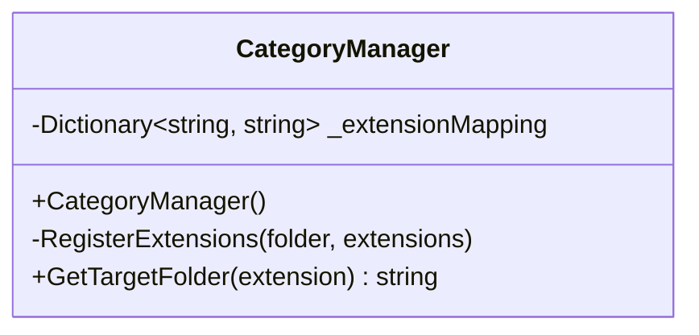
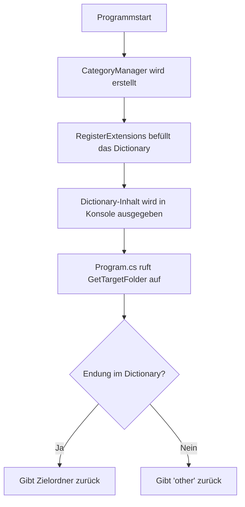

# File Organizer: CategoryManager

!!! info "Projektkontext"
    Der `CategoryManager` ist eine Klasse im Projekt **File Organizer**. Sie ist zuständig für die Zuordnung von Dateiendungen zu Zielordnern. Dieses Dokument zeigt den Aufbau der Klasse, die Testmethode und mögliche Erweiterungen.

---

## Klassenübersicht

Der `CategoryManager` verwaltet intern ein `Dictionary`, das jeder bekannten Dateiendung einen Zielordner zuweist. Die Klasse besteht aus drei Teilen: der Registrierung der Endungen im Konstruktor, der privaten Hilfsmethode `RegisterExtensions` und der öffentlichen Methode `GetTargetFolder`.



---

## Implementierung

### Konstruktor & Registrierung

Im Konstruktor werden alle unterstützten Dateiendungen einmalig registriert. Die private Methode `RegisterExtensions` nimmt einen Ordnernamen und beliebig viele Endungen entgegen (`params`) und trägt jede einzeln ins Dictionary ein.

```csharp
public CategoryManager()
{
    RegisterExtensions("images",      ".jpg", ".jpeg", ".png");
    RegisterExtensions("documents",   ".pdf", ".docx", ".txt");
    RegisterExtensions("powerpoints", ".pptx", ".ppt");
    RegisterExtensions("excel",       ".xlsx", ".xls");
    RegisterExtensions("videos",      ".mp4");

    _extensionMapping
        .SelectMany(kvp => new[] { $"{kvp.Key} => {kvp.Value}" })
        .ToList()
        .ForEach(Console.WriteLine);
}

private void RegisterExtensions(string folder, params string[] extensions)
{
    foreach (var extension in extensions)
    {
        _extensionMapping.Add(extension.ToLower(), folder);
    }
}
```

!!! note "Gross- und Kleinschreibung"
    Alle Endungen werden mit `.ToLower()` normalisiert. Damit werden Eingaben wie `.JPG` oder `.Jpg` gleich behandelt wie `.jpg`.

### Zielordner ermitteln

Die Methode `GetTargetFolder` nimmt eine Dateiendung entgegen und gibt den zugehörigen Ordnernamen zurück. Ist die Endung unbekannt, wird `"other"` zurückgegeben.

```csharp
public string GetTargetFolder(string extension)
{
    string ext = extension.ToLower();
    if (_extensionMapping.ContainsKey(ext))
    {
        return _extensionMapping[ext];
    }
    return "other";
}
```

### Unterstützte Dateitypen

| Endung | Zielordner |
|--------|------------|
| `.jpg`, `.jpeg`, `.png` | `images` |
| `.pdf`, `.docx`, `.txt` | `documents` |
| `.pptx`, `.ppt` | `powerpoints` |
| `.xlsx`, `.xls` | `excel` |
| `.mp4` | `videos` |
| *(alles andere)* | `other` |

---

## Ablauf



---

## Manuelle Überprüfung

Die Überprüfung der Klasse erfolgte direkt über `Program.cs`. Das Programm erstellt eine Instanz des `CategoryManager` und ruft `GetTargetFolder` für jede registrierte Endung auf. Die Ausgabe in der Konsole zeigt, ob die Zuordnungen korrekt sind.

```csharp
CategoryManager categoryManager = new CategoryManager();

Console.WriteLine("Ordner für .jpg: " + categoryManager.GetTargetFolder(".jpg"));
Console.WriteLine("Ordner für .png " + categoryManager.GetTargetFolder(".png"));
Console.WriteLine("Ordner für .pdf: " + categoryManager.GetTargetFolder(".pdf"));
// usw.
```

### Konsolenausgabe


*Die Ausgabe zeigt zuerst den vollständigen Dictionary-Inhalt, danach die Ergebnisse der einzelnen Abfragen.*

!!! success "Ergebnis"
    Alle Endungen wurden dem richtigen Zielordner zugewiesen. Die Ausgabe entspricht der erwarteten Zuordnung.

---

## Mögliche Erweiterung: Unit Tests

Die manuelle Überprüfung über `Program.cs` ist funktional, aber nicht automatisiert. Eine sinnvolle Erweiterung wäre der Einsatz von **Unit Tests** (z. B. mit MSTest oder xUnit), um die Korrektheit der Zuordnungen dauerhaft und automatisch sicherzustellen.

!!! abstract "Beispiel: Möglicher Unit Test"
    ```csharp
    [TestMethod]
    public void GetTargetFolder_Jpg_ReturnsImages()
    {
        var manager = new CategoryManager();
        Assert.AreEqual("images", manager.GetTargetFolder(".jpg"));
    }

    [TestMethod]
    public void GetTargetFolder_Unknown_ReturnsOther()
    {
        var manager = new CategoryManager();
        Assert.AreEqual("other", manager.GetTargetFolder(".xyz"));
    }
    ```

---

*Dokumentation erstellt am: 03.04.2026*
