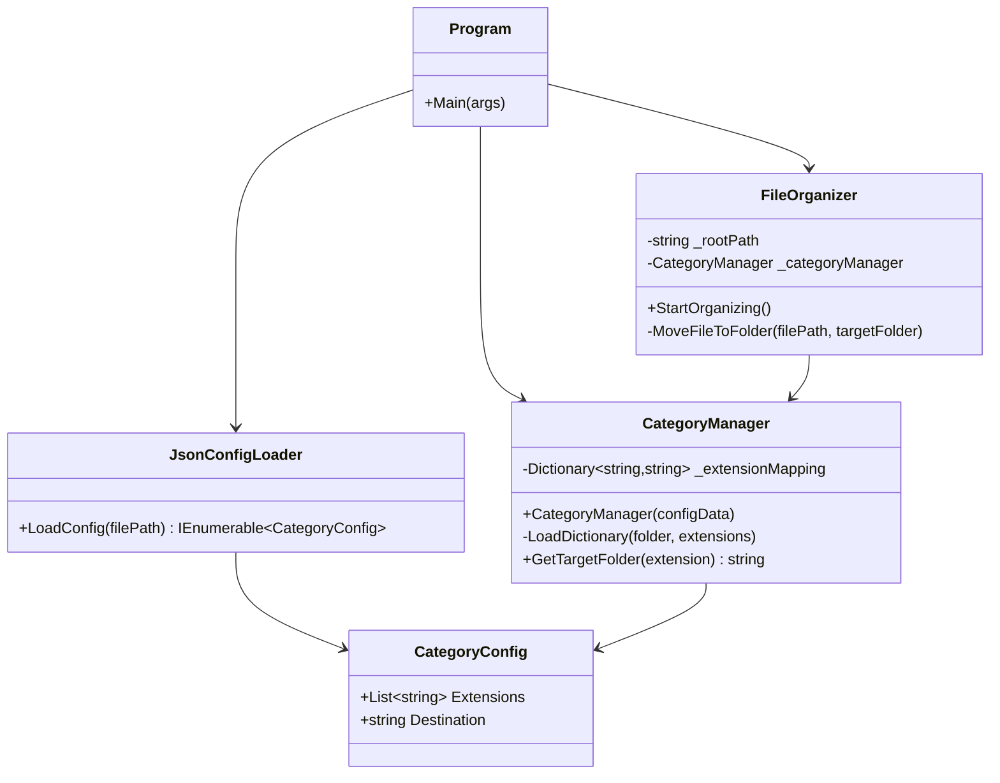
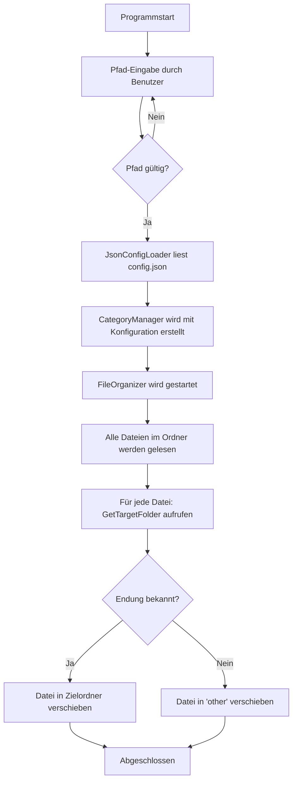

# File Organizer: Projektdokumentation

> **Hinweis:** Diese Datei ist für MkDocs optimiert und wird in der Repo-Ansicht nicht korrekt dargestellt.
> Zur vollständigen Dokumentation: <a href="https://ims-module1.gitlab.io/Qemals_Dokumentationen/File_Organizer_doku/" target="_blank">Zur Dokumentation</a>

!!! info "Projektübersicht"
    Der **File Organizer** ist eine Konsolenanwendung in C#, die Dateien in einem angegebenen Ordner automatisch nach ihrem Dateityp sortiert. Die Kategorien und Zielordner werden über eine externe `config.json` gesteuert. Das Projekt besteht aus vier Klassen sowie einer separaten Test-Suite mit xUnit.

---

## Architektur



---

## Ablauf



---

## Klassen

### CategoryConfig

`CategoryConfig` ist ein einfaches Datenmodell. Es repräsentiert einen einzelnen Eintrag aus der `config.json` und enthält die Liste der Dateiendungen sowie den zugehörigen Zielordner.

```csharp
public class CategoryConfig
{
    public List<string> Extensions { get; set; }
    public string Destination { get; set; }
}
```

---

### JsonConfigLoader

`JsonConfigLoader` ist zuständig für das Einlesen der `config.json`. Die statische Methode `LoadConfig` liest die Datei, deserialisiert den JSON-Inhalt und gibt eine Liste von `CategoryConfig`-Objekten zurück. Fehler wie eine fehlende Datei oder ein ungültiges Format werden mit aussagekräftigen Exceptions behandelt.

```csharp
public static IEnumerable<CategoryConfig> LoadConfig(string filePath)
{
    if (!File.Exists(filePath))
    {
        throw new FileNotFoundException($"The configuration file '{filePath}' was not found.");
    }
    try
    {
        var jsonString = File.ReadAllText(filePath);
        var config = JsonSerializer.Deserialize<IEnumerable<CategoryConfig>>(jsonString);
        if (config == null)
        {
            throw new ArgumentNullException($"The configuration file '{filePath}' is empty or has an invalid format.");
        }
        return config;
    }
    catch (Exception ex)
    {
        throw new Exception($"An error occurred while loading the configuration file '{filePath}': {ex.Message}");
    }
}
```

!!! note "Fehlerbehandlung"
    Die Methode wirft eine `FileNotFoundException`, wenn die Datei nicht existiert, und eine allgemeine `Exception` bei Parsing-Fehlern. So wird sichergestellt, dass das Programm mit einer klaren Fehlermeldung abbricht, anstatt stumm zu scheitern.

---

### CategoryManager

`CategoryManager` verwaltet ein internes `Dictionary`, das jeder Dateiendung einen Zielordner zuweist. Die Konfiguration wird nicht mehr fest im Code hinterlegt, sondern beim Erstellen der Instanz über `IEnumerable<CategoryConfig>` übergeben. Das macht die Klasse vollständig konfigurierbar.

=== "Konstruktor"

    Der Konstruktor validiert die übergebenen Daten und befüllt das Dictionary über `LoadDictionary`.

    ```csharp
    public CategoryManager(IEnumerable<CategoryConfig> configData)
    {
        if (configData == null)
        {
            throw new ArgumentNullException(nameof(configData), "Configuration data cannot be null.");
        }
        foreach (var item in configData)
        {
            if (item == null || string.IsNullOrEmpty(item.Destination) ||
                item.Extensions == null || item.Extensions.Any(ext => string.IsNullOrEmpty(ext)))
            {
                throw new ArgumentException("Category configuration cannot be null or empty.", nameof(configData));
            }
            LoadDictionary(item.Destination, item.Extensions.ToArray());
        }
    }
    ```

=== "LoadDictionary"

    Trägt alle Endungen einer Kategorie ins Dictionary ein.

    ```csharp
    private void LoadDictionary(string folder, params string[] extensions)
    {
        foreach (var extension in extensions)
        {
            _extensionMapping.Add(extension.ToLower(), folder);
        }
    }
    ```

=== "GetTargetFolder"

    Gibt den Zielordner für eine Endung zurück. Unbekannte, leere oder `null`-Eingaben liefern `"other"`.

    ```csharp
    public string GetTargetFolder(string extension)
    {
        var optimizedExtension = extension?.ToLower();
        if (string.IsNullOrEmpty(extension) || !_extensionMapping.ContainsKey(optimizedExtension))
        {
            return "other";
        }
        return _extensionMapping[optimizedExtension];
    }
    ```

!!! note "Gross- und Kleinschreibung"
    Alle Endungen werden mit `.ToLower()` normalisiert. Eingaben wie `.JPG` oder `.Jpg` werden gleich behandelt wie `.jpg`.

#### Unterstützte Dateitypen (aus config.json)

| Endungen | Zielordner |
|----------|------------|
| `.png`, `.jpg`, `.jpeg`, `.gif`, `.webp`, `.svg`, `.tiff`, `.bmp`, `.heic`, `.raw`, `.psd`, `.ai`, `.eps`, `.ico` | `images` |
| `.pdf`, `.doc`, `.docx`, `.txt`, `.rtf`, `.odt`, `.pages`, `.epub`, `.md`, `.log` | `documents` |
| `.ppt`, `.pptx`, `.pptm`, `.key`, `.odp`, `.ppsx` | `presentations` |
| `.xls`, `.xlsx`, `.xlsm`, `.csv`, `.ods`, `.numbers`, `.tsv` | `spreadsheets` |
| `.mp4`, `.mov`, `.avi`, `.mkv`, `.webm`, `.flv`, `.wmv`, `.m4v`, `.mpg`, `.mpeg`, `.ts` | `videos` |
| `.mp3`, `.wav`, `.aac`, `.flac`, `.ogg`, `.m4a`, `.wma`, `.aiff` | `audio` |
| `.zip`, `.rar`, `.7z`, `.tar`, `.gz`, `.pkg`, `.dmg`, `.iso` | `archives` |
| *(alles andere)* | `other` |

---

### FileOrganizer

`FileOrganizer` übernimmt die eigentliche Arbeit: Er liest alle Dateien im angegebenen Ordner, fragt für jede Datei den Zielordner beim `CategoryManager` ab und verschiebt sie. Existiert der Zielordner noch nicht, wird er automatisch erstellt.

```csharp
public void StartOrganizing()
{
    var files = Directory.GetFiles(_rootPath);
    foreach (string file in files)
    {
        string ext = Path.GetExtension(file);
        string folder = _categoryManager.GetTargetFolder(ext);
        MoveFileToFolder(file, folder);
    }
}

private void MoveFileToFolder(string filePath, string targetFolder)
{
    string pathFolder = Path.Combine(_rootPath, targetFolder);
    string finalPath = Path.Combine(pathFolder, Path.GetFileName(filePath));

    if (!Directory.Exists(pathFolder))
    {
        Directory.CreateDirectory(pathFolder);
    }
    File.Move(filePath, finalPath);
}
```

---

## Konfiguration (config.json)

Die Kategorien werden vollständig über eine externe JSON-Datei gesteuert. Neue Dateitypen können jederzeit hinzugefügt werden, ohne den Code zu ändern.

```json
[
  { "Extensions": [".png", ".jpg", ".jpeg", "..."], "Destination": "images" },
  { "Extensions": [".pdf", ".docx", ".txt", "..."], "Destination": "documents" },
  { "Extensions": [".pptx", ".ppt", "..."],         "Destination": "presentations" },
  { "Extensions": [".xlsx", ".csv", "..."],          "Destination": "spreadsheets" },
  { "Extensions": [".mp4", ".mkv", "..."],           "Destination": "videos" },
  { "Extensions": [".mp3", ".wav", "..."],           "Destination": "audio" },
  { "Extensions": [".zip", ".rar", "..."],           "Destination": "archives" }
]
```

!!! tip "Erweiterbar"
    Um einen neuen Dateityp zu unterstützen, genügt es, einen neuen Eintrag in der `config.json` hinzuzufügen. Ein Neustart des Programms lädt die Konfiguration automatisch.

---

## Tests

Die Tests wurden mit **xUnit** geschrieben und decken die beiden Kernklassen `CategoryManager` und `JsonConfigLoader` ab.

### CategoryManager Tests

Die Tests prüfen drei Szenarien: korrekte Zuordnung bei gültigen Endungen, Gross-/Kleinschreibung und den Fallback bei ungültigen Eingaben.

=== "Gültige Endungen"

    Stellt sicher, dass bekannte Endungen dem richtigen Zielordner zugewiesen werden.

    ```csharp
    [Theory]
    [InlineData(".png",  "images")]
    [InlineData(".pdf",  "documents")]
    [InlineData(".pptx", "presentations")]
    [InlineData(".xlsx", "spreadsheets")]
    [InlineData(".mp4",  "videos")]
    public void GetTargetFolder_ValidExtensions_ReturnsCorrectFolder(string extension, string expectedFolder)
    {
        string actual = categoryManager.GetTargetFolder(extension);
        Assert.Equal(expectedFolder, actual);
    }
    ```

=== "Grossschreibung"

    Stellt sicher, dass Grossbuchstaben korrekt normalisiert werden.

    ```csharp
    [Theory]
    [InlineData(".PNG",  "images")]
    [InlineData(".PDF",  "documents")]
    [InlineData(".PPTX", "presentations")]
    [InlineData(".XLSX", "spreadsheets")]
    [InlineData(".MP4",  "videos")]
    public void GetTargetFolder_UppercaseExtensions_ReturnsCorrectFolder(string extension, string expectedFolder)
    {
        string actual = categoryManager.GetTargetFolder(extension);
        Assert.Equal(expectedFolder, actual);
    }
    ```

=== "Ungültige Eingaben"

    Stellt sicher, dass unbekannte, leere und `null`-Eingaben den Fallback `"other"` liefern.

    ```csharp
    [Theory]
    [InlineData(".doesnotexist")]
    [InlineData(".")]
    [InlineData(null)]
    [InlineData("")]
    public void GetTargetFolder_InvalidExtensions_ReturnsFallbackFolder(string extension)
    {
        string actual = categoryManager.GetTargetFolder(extension);
        Assert.Equal("other", actual);
    }
    ```

---

### JsonConfigLoader Tests

Die Tests prüfen das korrekte Einlesen einer gültigen Konfigurationsdatei sowie das Verhalten bei einer fehlenden Datei.

=== "Datei laden"

    Prüft, ob die JSON-Datei korrekt deserialisiert wird, alle 7 Objekte erstellt werden und die ersten zwei Einträge korrekt sind.

    ```csharp
    [Fact]
    public void LoadConfig_Fileloading_CreatesObjects()
    {
        var result = JsonConfigLoader.LoadConfig(testFilePath);

        Assert.NotNull(result);
        Assert.Equal(7, result.Count());
        Assert.Equal("images",    result.ElementAt(0).Destination);
        Assert.Equal("documents", result.ElementAt(1).Destination);
    }
    ```

=== "Datei nicht gefunden"

    Prüft, ob eine `FileNotFoundException` geworfen wird, wenn die Datei nicht existiert.

    ```csharp
    [Fact]
    public void LoadConfig_FileNotFound_ThrowsFileNotFoundException()
    {
        Assert.Throws<FileNotFoundException>(
            () => JsonConfigLoader.LoadConfig("file_not_found.json")
        );
    }
    ```

---

### Testordner-Skript

Für die manuelle Überprüfung des `FileOrganizer` wurde ein PowerShell-Skript erstellt, das einen Testordner mit Beispieldateien verschiedener Typen anlegt.

```powershell
$path = "C:\Users\qemal\TestFolder"
if (Test-Path $path) {
    Remove-Item -Recurse -Force $path
}
New-Item -ItemType Directory -Force -Path $path

"testdoku.pdf", "testbild.png", "testtabelle.xlsx",
"testpowerpoint.pptx", "testvideo.mp4", "testother.py" |
ForEach-Object { New-Item -ItemType File -Path $path -Name $_ }
```

!!! tip "Verwendung"
    Das Skript löscht den Testordner zuerst (falls vorhanden) und erstellt ihn neu mit sechs Testdateien – eine pro unterstützter Kategorie plus eine unbekannte Endung (`.py` → `other`).

---

## Zusammenfassung

| Klasse | Aufgabe |
|--------|---------|
| `CategoryConfig` | Datenmodell für einen Konfigurations-Eintrag |
| `JsonConfigLoader` | Liest und deserialisiert die `config.json` |
| `CategoryManager` | Verwaltet die Endungs-Zuordnung und liefert Zielordner |
| `FileOrganizer` | Verschiebt Dateien anhand der Zuordnung |

!!! success "Testabdeckung"
    Alle kritischen Methoden sind durch xUnit-Tests abgedeckt: gültige Eingaben, Gross-/Kleinschreibung, Randfälle (`null`, leer, unbekannt) und Fehlerverhalten beim Laden der Konfiguration.

---

*Dokumentation erstellt am: 20.04.2026*
