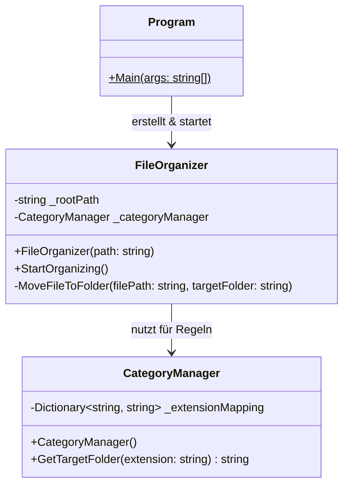

```mermaid
classDiagram
    class Program {
        +Main(args: string[])$
    }

    class FileOrganizer {
        -string _rootPath
        -CategoryManager _categoryManager
        +FileOrganizer(path: string)
        +StartOrganizing()
        -MoveFileToFolder(filePath: string, targetFolder: string)
    }

    class CategoryManager {
        -Dictionary~string, string~ _extensionMapping
        +CategoryManager()
        +GetTargetFolder(extension: string) string
    }

    Program --> FileOrganizer : erstellt & startet
    FileOrganizer --> CategoryManager : nutzt für Regeln
```
